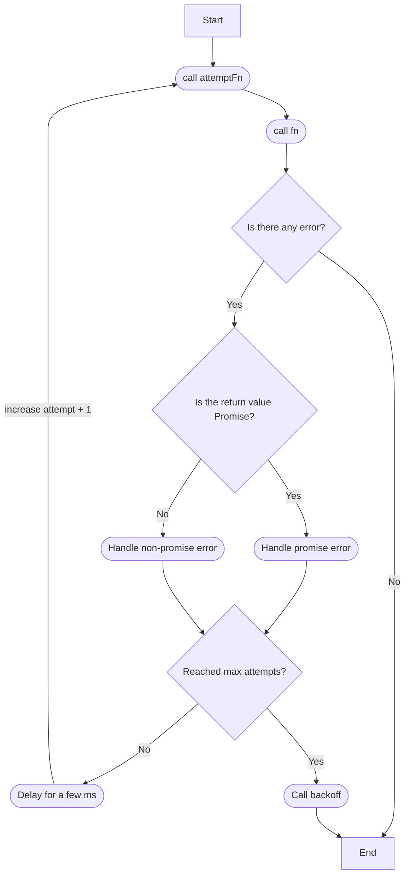

# Node Retry

## 개요

어떤 함수가 실패 했을때 재시도하는 함수를 구현합니다.

최대 재시도 회수에 도달하면 backoff 함수를 실행하고 함수를 종료합니다.

## 명세

```ts
type MaybePromise<T> = T | Promise<T>

export type Retry = (
  maxAttempt: number,
  delay: number,
) => <Fn extends (...args: any[]) => any>(
  fn: Fn,
) => <Backoff extends (e: unknown) => any>(
  backoff: Backoff,
) => (
  ...args: Parameters<Fn>
) => MaybePromise<ReturnType<Fn> | ReturnType<Backoff>>
```

## 유즈케이스

```ts
const callFn = async (id: string) => {
  const response = await fetch(`/api/:${id}`)
  return response.text()
}

const handleError = (e) => {
  logger.writeLog(e)
}

const fetchAPI = retry(10, 100)(callFn)(handleError)

await fetchAPI('1234')
```

## 설계


